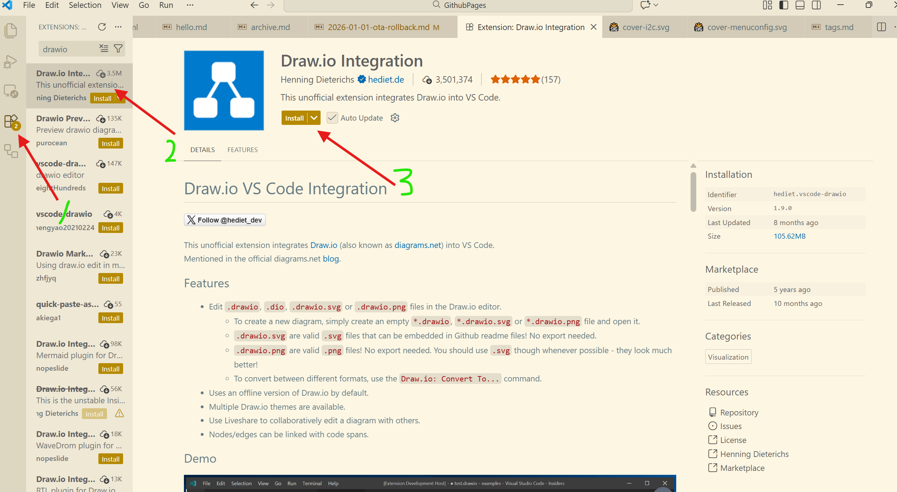
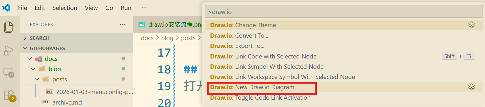
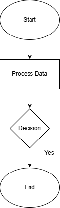
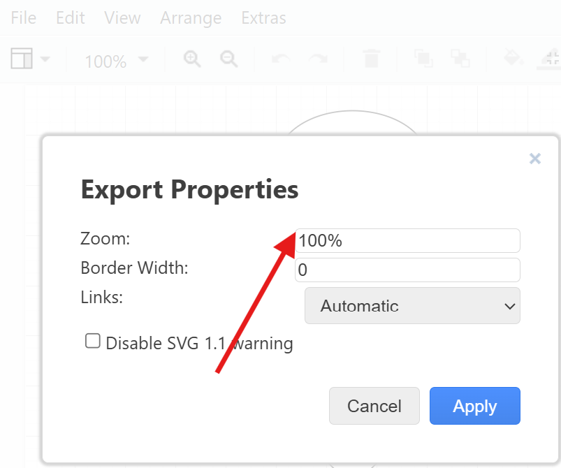

# 基于VSCode的Draw.io插件绘制框图

## 概述
Draw.io是开源的流程图、UML 图和各种图表绘制工具。相较于Office里的Visio,Draw.io不仅具有轻量级的特点，也能同时在Windows和Linux系统使用。

Draw.io提供了面向VSCode的插件，在VsCode中绘制框图(流程图)，可以快速地将代码逻辑、数据流等可视化呈现，提高开发效率的同时，也加快了文档的编写速度。

在大模型时代，文字撰写、编码甚至画图都可以通过大模型这个得力助手来完成，但是大模型的输出结果往往需要人工进行二次编辑和优化，而这个过程往往需要借助一些辅助工具。框图的绘制可以借助大模型生成的文本描述，然后通过VSCode中的Draw.io插件进行编辑修改，最终生成高质量的框图。

下面整理下如何安装Draw.io插件，以及如何使用它来绘制框图并导出高清图的流程。

## 1.安装Draw.io插件
打开VsCode，然后按照以下步骤安装 Draw.io 插件：

1. 点击左侧的扩展图标（或使用快捷键 `Ctrl+Shift+X`）。
2. 在搜索框中输入 `draw.io`。
3. 找到 `Draw.io Integration` 插件，点击安装。



## 2.使用Draw.io插件绘制框图
### 2.1 从零开始创建框图
1. 在VS Code中打开一个新的文件（或已有的文件）。
2. 点击顶部菜单的 `View → Command Palette`（或使用快捷键 `Ctrl+Shift+P`）。
3. 在命令面板中输入 `Draw.io`，点击执行 New Draw.io Diagram。


4. Draw.io 插件会在侧边栏打开一个新的 Draw.io 窗口。
5. 在 Draw.io 窗口中，使用鼠标或键盘绘制框图。可以使用 Draw.io 提供的各种工具（如矩形、椭圆、箭头等）来绘制不同的元素。
6. 绘制完成后，点击顶部菜单的 `File → Export as...`，选择导出为高清图（如 PNG、JPEG 等）。
### 2.2 从文本描述创建框图

1. 在VS Code中的"Explorer"视图中，右键新建文件，命名为`user.drawio`
2. 针对`user.drawio`右键，选择`Open with Text Editor`,然后将大模型生成的文本描述复制到`user.drawio`文件中。这里让大模型输出框图时，提示词要求生成Draw.io支持的XML格式文本。
3. 保存文件后，右键`user.drawio`文件，选择`Open with Draw.io Editor`，即可在Draw.io窗口中看到对应的框图。
   
下面是一个简单的Draw.ioXML格式文本示例：

```
<mxGraphModel dx="950" dy="532" grid="1" gridSize="10" guides="1" tooltips="1" connect="1" arrows="1" fold="1" page="1" pageScale="1" pageWidth="827" pageHeight="1169" background="#ffffff" math="0" shadow="0">
  <root>
    <mxCell id="0"/>
    <mxCell id="1" parent="0"/>
    <mxCell id="2" value="Start" style="ellipse;whiteSpace=wrap;html=1;" vertex="1" parent="1">
      <mxGeometry x="200" y="20" width="120" height="80" as="geometry"/>
    </mxCell>
    <mxCell id="3" value="Process Data" style="rounded=0;whiteSpace=wrap;html=1;" vertex="1" parent="1">
      <mxGeometry x="200" y="140" width="120" height="60" as="geometry"/>
    </mxCell>
    <mxCell id="4" value="Decision" style="rhombus;whiteSpace=wrap;html=1;" vertex="1" parent="1">
      <mxGeometry x="220" y="240" width="80" height="80" as="geometry"/>
    </mxCell>
    <mxCell id="5" value="End" style="ellipse;whiteSpace=wrap;html=1;" vertex="1" parent="1">
      <mxGeometry x="200" y="360" width="120" height="80" as="geometry"/>
    </mxCell>
    <mxCell id="6" value="" style="endArrow=classic;html=1;exitX=0.5;exitY=1;entryX=0.5;entryY=0;" edge="1" parent="1" source="2" target="3">
      <mxGeometry width="50" height="50" relative="1" as="geometry">
        <mxPoint x="260" y="120" as="sourcePoint"/>
        <mxPoint x="260" y="150" as="targetPoint"/>
      </mxGeometry>
    </mxCell>
    <mxCell id="7" value="" style="endArrow=classic;html=1;exitX=0.5;exitY=1;entryX=0.5;entryY=0;" edge="1" parent="1" source="3" target="4">
      <mxGeometry width="50" height="50" relative="1" as="geometry">
        <mxPoint x="260" y="220" as="sourcePoint"/>
        <mxPoint x="260" y="250" as="targetPoint"/>
      </mxGeometry>
    </mxCell>
    <mxCell id="8" value="" style="endArrow=classic;html=1;exitX=0.5;exitY=1;entryX=0.5;entryY=0;" edge="1" parent="1" source="4" target="5">
      <mxGeometry width="50" height="50" relative="1" as="geometry">
        <mxPoint x="260" y="340" as="sourcePoint"/>
        <mxPoint x="260" y="370" as="targetPoint"/>
      </mxGeometry>
    </mxCell>
    <mxCell id="9" value="Yes" style="text;html=1;strokeColor=none;fillColor=none;align=center;verticalAlign=middle;whiteSpace=wrap;rounded=0;" vertex="1" parent="1">
      <mxGeometry x="280" y="320" width="40" height="20" as="geometry"/>
    </mxCell>
  </root>
</mxGraphModel>
```
在Draw.io窗口中打开后，即可看到如下框图：
<figure markdown="1" style="text-align:center;">
  
</figure>
## 3.导出高清图
1. 在 Draw.io 窗口中，点击 `File → Export as...`。
2. 在导出对话框中，选择导出为高清图的格式（如 PNG、SVG 等）。
3. 点击 `Export` 按钮，选择保存导出的图文件。这里有svg和png两种格式可选。建议导出svg图。
 
这里有个小技巧：导出png格式的图片时，建议在File选项里的Properties设置图像的缩放比例，以获得更好的清晰度，通常建议设置到300%甚至更高。

<figure markdown="1" style="text-align:center;">
  { width="50%" }
</figure>


## 4.插入图片

在Draw.io窗口中，点击`Insert → Image`，选择要插入的图片文件。调整图片大小和位置，使其符合框图的布局需求。<span style="color: #80000d; padding: 2px 4px; border-radius: 3px;">但是，如果要插入draw.io导出的png图片时，建议使用`File -> Import`来导入图片，这样可以保证图片的清晰度不会而且支持再编辑。</span>

 

